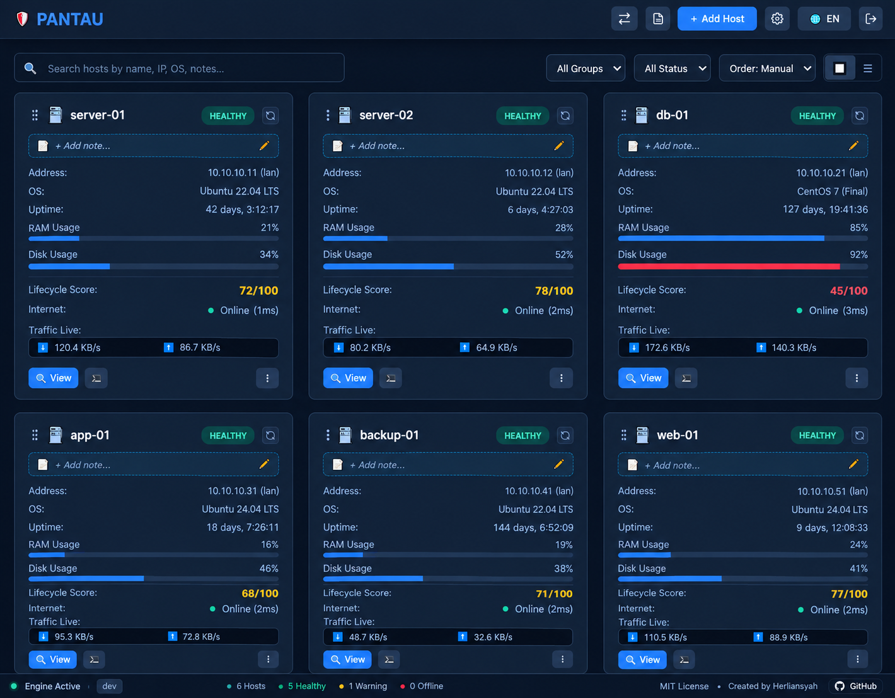

<p align="center">
  <a href="#readme">
    
  </a>
</p>

<h1 align="center">Pantau</h1>

<p align="center">
  <b>Sistem Pemantauan Server Linux Berbasis Agentless SSH, Desired State Drift Engine & Manajemen Interaktif</b><br>
  <i>Single binary. Tanpa instalasi agen remote. Embedded SQLite. Native SSH.</i>
</p>

<p align="center">
  <a href="README.md"><b>English</b></a> •
  <a href="README.id.md"><b>Bahasa Indonesia</b></a> •
  <a href="docs/user-guide.id.md"><b>📖 Panduan Penggunaan</b></a>
</p>

<p align="center">
  
  
  
  
  
</p>

<p align="center">
  
</p>

> [!WARNING]
> **Peringatan Keamanan & Operasional Produksi**: Pantau adalah perangkat lunak *open-source* untuk pemantauan dan manajemen server Linux yang beroperasi dengan mengeksekusi perintah SSH, manipulasi file via SFTP, dan penyisipan kunci secara langsung dengan hak akses istimewa (*privileged/root*). Perangkat lunak ini disediakan atas dasar **"SEBAGAIMANA ADANYA" (*AS IS*)** tanpa jaminan apa pun. Pengguna memikul tanggung jawab penuh atas segala tindakan eksekusi remote, perlindungan kredensial/kunci privat, serta pemeliharaan cadangan (*backup*) mandiri. Jangan pernah membuka akses Pantau ke internet publik tanpa perlindungan reverse proxy, autentikasi ketat, dan enkripsi TLS/HTTPS.

---

## 📖 Ringkasan

**Pantau** adalah sistem pemantauan dan manajemen infrastruktur server Linux mandiri (*self-hosted*), ringan, dan berformat *single binary* yang dibangun dengan Go. Berbeda dari sistem tradisional seperti Prometheus/Node-Exporter, Zabbix, atau Datadog, Pantau beroperasi **100% agentless** melalui protokol SSH standar (`port 22`). Server target **tidak memerlukan daemon tambahan, tidak ada instalasi agen, dan tidak ada scraper telemetri yang membebani sistem**.

Pantau menginspeksi Host remote melalui perintah SSH non-interaktif, memvalidasi kondisi sistem secara berkala terhadap aturan **Desired State**, mendiagnosis deviasi secara otomatis melalui **Root Cause Excerpt**, mentransfer file antar-host langsung lewat memori, serta menyediakan Web Terminal interaktif (xterm.js) dan SFTP Code Editor langsung dari browser.

> [!TIP]
> **Playbook Administrator**: Mencari alur kerja operasional langkah-demi-langkah, prosedur pemulihan bencana, atau panduan pengerasan keamanan? Baca [Panduan Administrator Pantau](docs/user-guide.id.md) ([English](docs/user-guide.md)).

---

## 🏛️ Arsitektur Sistem

```
                                  +--------------------------------------------------+
                                  |                 Web Browser Client               |
                                  |     (Single-Page App, Fixed Shell, xterm.js)     |
                                  +------------------------+-------------------------+
                                                           | HTTP / WebSocket
                                                           v
+--------------------------------------------------------------------------------------------------------------------+
|                                                PANTAU CONTROL PLANE (Go)                                           |
|                                                                                                                    |
|  +---------------------+   +---------------------+   +---------------------+   +--------------------------------+  |
|  |   Inspection Loop   |   |   Drift Engine      |   |  Hybrid Alerting    |   | Cross-Host Transfer Engine     |  |
|  | (SSH Collector: 5m)|   | (Desired vs Actual) |   | (Telegram/Webhooks) |   | (Piped FIFO Stream, Zero-Disk) |  |
|  +----------+----------+   +----------+----------+   +----------+----------+   +---------------+----------------+  |
|             |                         |                         |                              |                   |
|             +-------------------------+------------+------------+                              |                   |
|                                                    |                                           |                   |
|                                       +------------v-------------+                             |                   |
|                                       | Embedded SQLite (WAL)    |                             |                   |
|                                       | Encrypted Snapshot/Argon2|                             |                   |
|                                       +------------+-------------+                             |                   |
+----------------------------------------------------|-------------------------------------------|-------------------+
                                                     | Native SSH Protocol                       | Stream Pipe
                                                     v                                           v
                       +-------------------------------------------+   +-------------------------------------------+
                       |           Remote Linux Host A             |   |           Remote Linux Host B             |
                       |  (Ubuntu / Debian / RHEL / CentOS 6-9)    |   |  (Ubuntu / Debian / RHEL / CentOS 6-9)    |
                       |  - POSIX Standard CLI Tools (`ps`, `df`)  |   |  - POSIX Standard CLI Tools (`ps`, `df`)  |
                       |  - Docker Engine / Containers             |   |  - Docker Engine / Containers             |
                       |  - Tanpa Daemon / Tanpa Instalasi Agen    |   |  - Tanpa Daemon / Tanpa Instalasi Agen    |
                       +-------------------------------------------+   +-------------------------------------------+
```

---

## ✨ Fitur Utama

### 1. 🔍 Inspeksi Agentless SSH & 1-Click Key Provisioning
- Mengambil metrik sistem secara aktual (CPU Load, RAM, partisi Disk, Network Egress, Sockets, Uptime, Kernel) murni melalui koneksi SSH standar.
- **One-Time Key Provisioning**: Masukkan password server target sekali di RAM. Pantau secara idempoten menyalin public key universal RSA 4096-bit ke `~/.ssh/authorized_keys` (didukung universal dari OpenSSH 5.3+ lawas hingga Linux modern) dan langsung menghapus password dari memori.
- **Kompatibilitas Server Lawas**: Mendukung cipher warisan (`aes128-cbc`, `3des-cbc`, `diffie-hellman-group1-sha1`, `ssh-dss`) untuk memantau server Linux legasi (CentOS 6, Debian 7, OpenSSH 5.3+).
- **Inspeksi Massal & Kesegaran Data**: Pemicuan inspeksi serentak seluruh host via tombol `⚡ Inspect All`, pembaruan otomatis berkala yang dapat dikonfigurasi, serta visualisasi waktu inspeksi relatif dan deteksi data usang (*Stale Inspection*).

### 2. 📋 Baseline Desired State & Otomatisasi Drift Engine
- **1-Click Baseline**: Mendeteksi otomatis container Docker yang aktif, partisi disk, cron job, dan service database (`mysqld`, `postgres`, `redis`, `nginx`).
- **Deteksi Drift Real-Time**: Memberikan peringatan otomatis saat container berhenti mendadak, disk melebihi batas ambang (misal: `> 85%`), cron job terhapus, atau file backup basi.

### 3. 🩺 Penangkapan Diagnostik Root Cause Excerpt
- Saat terjadi kegagalan service atau crash container, Pantau langsung mengekstrak konteks insiden secara instan:
  - Kode keluar (*exit code*) container Docker dan penanda memori habis `OOMKilled`.
  - 50 baris log error terakhir dari `journalctl -u <service>` atau `docker logs <container>`.
- Kronologi diagnostik insiden langsung tersaji pada tab *Timeline* pada modal Host.

### 4. 🚀 Streaming Transfer Antar-Host (Piped Cross-Host Transfer)
- Mengalirkan file dan folder antar dua server remote secara langsung melalui *memory pipe* tanpa perlu disimpan ke disk lokal Pantau terlebih dahulu.
- **Fast Stream Mode**: Memaksimalkan kecepatan transfer via pipa kompresi `tar`.
- **Verified Mode**: Menghitung dan mencocokkan checksum SHA256 ujung-ke-ujung (*end-to-end*) pada server sumber dan target sebelum menyatakan transfer selesai.

### 5. 🛡️ Observabilitas Jaringan & Keamanan
- **Internet Egress & Latensi**: Menguji konektivitas keluar dan latensi ping ke DNS global (`1.1.1.1`).
- **Live Active Sockets**: Merekap daftar IP publik eksternal yang sedang terhubung dan total koneksi aktif.
- **Brute-Force & Failed Login Tracking**: Memantau percobaan login gagal dan indikasi serangan brute-force via `/var/log/auth.log` atau `journalctl _SYSTEMD_UNIT=ssh.service`.
- **Klasifikasi Bidang Serang (Attack Surface)**: Mengidentifikasi port listen yang terbuka, jenis binding IP (`0.0.0.0` vs `127.0.0.1`), serta mengklasifikasikan tingkat risikonya (*Public Internet* vs *Localhost Only*).

### 6. 🔐 System Snapshot Terenkripsi & Sinkronisasi GitHub
- Mengenkripsi seluruh konfigurasi Host, kredensial SSH, dan aturan desired state ke dalam file snapshot `.enc` menggunakan derivasi kunci **Argon2id** dan enkripsi terotentikasi **AES-256-GCM**.
- **Sinkronisasi GitHub Otomatis**: Mendorong (*push*) file snapshot terenkripsi ke repositori GitHub privat secara terjadwal.
- **Disaster Recovery Wizard**: Pulihkan seluruh inventaris monitoring dari nol hanya menggunakan token GitHub + path repositori atau file `.enc` cadangan.

### 7. 💻 Interactive Web Terminal & SFTP File Manager
- **Web Terminal**: Akses shell interaktif di browser berbasis `xterm.js` melalui koneksi WebSocket SSH PTY dengan dukungan warna ANSI dan penyesuaian ukuran terminal.
- **SFTP Explorer & Code Editor**: Eksplorasi direktori remote, unggah/unduh file, ubah izin (*chmod*), serta sunting script dan file konfigurasi langsung menggunakan editor CodeMirror (tema Nord).

### 8. 🌐 Antarmuka Dwibahasa (English & Bahasa Indonesia)
- Tombol pemilih bahasa instan (`🌐 EN` / `🌐 ID`) langsung di bilah navigasi atas (header).
- Kamus translasi lokal zero-dependency tersimpan di `localStorage` (default: Bahasa Inggris).
- Istilah teknis domain kanonikal (*Host*, *Desired State*, *Drift*, *Root Cause Excerpt*, *Snapshot*) tetap dipertahankan sesuai konvensi industri.

### 9. 🩺 Audit Transparan Lifecycle Assessment 6-Faktor & Rekomendasi Hardware Refresh
- Mengukur kelayakan operasional Host melalui 6 faktor transparan: status Linux OS End-of-Life (EOL), batas masa pakai produktif hardware (*Productive Lifespan* & kurva degradasi MTBF berdasarkan tanggal BIOS bare-metal vs usia deployment OS VM Cloud), tekanan memori RAM, rasio saturasi CPU terhadap core, kapasitas disk root, dan integritas I/O kernel (`dmesg`).
- **Panduan Peremajaan Perangkat Keras**: Mengidentifikasi server yang melampaui masa pakai produktif 3–5 tahun atau usia kritis 8 tahun secara otomatis, menyajikan checklist breakdown audit, serta menghasilkan kartu justifikasi resmi penggantian (*Hardware Refresh*).

### 10. 🛡️ Kesiapan Airgapped & Self-Contained Web Assets (Zero-CDN)
- 100% pustaka vendor antarmuka pengguna (`xterm.js`, `xterm-addon-fit`, dan `CodeMirror` lengkap dengan 8 mode bahasa: XML, JS, CSS, HTML, C-like, PHP, Shell, YAML) disematkan langsung ke dalam binary Go via `go:embed`.
- Menegakkan *Content Security Policy* (CSP) ketat tanpa permintaan jaringan keluar ke CDN publik, menjamin antarmuka berfungsi 100% sempurna pada intranet terisolasi, VPC tertutup, maupun lingkungan *airgapped*.

### 11. 📂 Host Grouping, Terminal Maximize & Port Auto-Scan Fallback
- **Host Group**: Mengelompokkan Host berdasarkan fungsi server atau lingkungan (misal: *Server Utama*, *Testing*, *Database Cluster*) dengan baris/kartu pemisah visual pada tampilan Grid View maupun List View.
- **Terminal Maximize**: Memperluas antarmuka terminal ke ukuran layar penuh peramban (*full-viewport*) dengan tetap mempertahankan pintasan tombol interaktif (seperti `Esc` pada `vim`, `nano`, atau `htop`).
- **Port Auto-Scan Fallback**: Mendeteksi ketersediaan port secara berurutan (`8080` hingga `8099`) saat server dijalankan dengan port default, mencegah kegagalan startup akibat konflik port yang sedang digunakan.

### 12. ⚡ Terminal Preset & Split-Pane Multi-Terminal
- **Terminal Preset**: Menyimpan pintasan perintah diagnostik berulang (`htop`, `docker stats`, `journalctl -f`) dengan pengecekan ketersediaan utilitas remote sebelum eksekusi (*pre-flight check*).
- **Split-Pane Web Terminal**: Membuka dua sesi terminal berdampingan secara simultan (`Alt+\`) untuk memantau atau membandingkan performa beberapa server remote sekaligus secara real-time.

### 13. 🔐 Autentikasi Dua Faktor TOTP Airgapped & Pemulihan Darurat
- **Standar RFC 6238 TOTP**: Memperketat autentikasi login administrator menggunakan token satu-kali-pakai berbasis waktu yang kompatibel dengan aplikasi authenticator umum (Google Authenticator, Aegis, 1Password, Bitwarden).
- **100% Pendaftaran Mandiri Offline**: Secret key Base32 dan kode QR di-render murni di sisi peramban klien tanpa permintaan jaringan ke API eksternal atau risiko kebocoran data.
- **Kode Pemulihan Darurat (Recovery Codes)**: Menghasilkan 8 kode cadangan sekali-pakai dengan opsi salin instan dan unduh berkas teks untuk pemulihan akun darurat.
- **Proteksi Brute-Force Rate Limiting**: Menerapkan masa jeda pendinginan otomatis selama 30 detik setelah 3 kali percobaan verifikasi gagal secara berturut-turut.
- **Flag Bypass Darurat Host**: Argumen startup `-disable-2fa` memungkinkan administrator menonaktifkan 2FA langsung melalui konsol server utama jika perangkat authenticator dan kode pemulihan hilang.

### 14. 🖥️ Global Multi-Tab Terminal Dock & Persistent Session Pill
- **Multi-Tab Terminal Dock**: Dok terminal terintegrasi di bagian bawah aplikasi yang dapat menampung banyak sesi shell SSH PTY bersamaan ke berbagai server remote berbeda.
- **Penamaan Tab Dinamis (Inline Rename)**: Ubah nama label tab terminal langsung dari UI untuk mempermudah identifikasi tugas pemeliharaan antar-server.
- **Session Pill Mengambang Persisten**: Minimalkan dock menjadi tombol pil (*Session Pill*) elegan di pojok kanan bawah yang menampilkan jumlah sesi aktif; navigasi dashboard dan pantau metrik tanpa memutus proses shell atau tail log yang sedang berjalan.
- **Peralihan Tampilan Fleksibel**: Buka tutup dok, bagi layar menjadi dua (*Split-Pane* `Alt+\`), atau maksimalkan ke layar penuh (*full-viewport*) dalam satu klik tanpa merusak sesi SSH maupun aplikasi interaktif (`htop`, `tmux`, `nano`).

---

## 🚀 Panduan Memulai Cepat (Quick Start)

### Opsi 1: Binary Mandiri (Paling Praktis)

Unduh binary terbaru untuk arsitektur server Anda dari [GitHub Releases](https://github.com/herliansyah/pantau/releases):

```bash
# Berikan izin eksekusi pada binary
chmod +x pantau

# Jalankan Pantau dengan port dan lokasi database kustom
./pantau -port 8080 -db data/pantau.db
```

Buka `http://localhost:8080` di browser Anda.  
**Password Default**: `admin` *(segera ganti melalui menu Settings)*.

---

### Opsi 2: Docker Compose

```yaml
version: "3.8"

services:
  pantau:
    image: ghcr.io/herliansyah/pantau:latest
    container_name: pantau
    restart: unless-stopped
    ports:
      - "8080:8080"
    volumes:
      - pantau-data:/data
    environment:
      - PANTAU_PORT=8080
      - PANTAU_DB=/data/pantau.db

volumes:
  pantau-data:
```

*(Catatan: Variabel lingkungan standar `PORT` dan `DB_PATH` juga didukung sebagai fallback otomatis).*

```bash
docker compose up -d
```

---

### Opsi 3: Systemd Service (Linux Produksi)

Buat file unit `/etc/systemd/system/pantau.service`:

```ini
[Unit]
Description=Pantau Server Monitoring & Management
After=network.target

[Service]
Type=simple
User=root
WorkingDirectory=/opt/pantau
ExecStart=/opt/pantau/pantau -port 8080 -db /opt/pantau/data/pantau.db
Restart=always
RestartSec=5
LimitNOFILE=65535

[Install]
WantedBy=multi-user.target
```

```bash
systemctl daemon-reload
systemctl enable --now pantau
```

---

## ⚙️ Referensi Konfigurasi

| Argumen (Flag) | Environment Variable | Default | Keterangan |
| :--- | :--- | :--- | :--- |
| `-port` | `PANTAU_PORT` (atau `PORT`) | `8080` | Port listening HTTP (auto-scan port `8080`–`8099` jika default) |
| `-db` | `PANTAU_DB` (atau `DB_PATH`) | `pantau.db` | Lokasi file basis data SQLite |
| `-open` | - | `true` (Windows) / `false` | Buka peramban web bawaan secara otomatis saat startup |
| `-disable-2fa` | - | `false` | Flag bypass darurat untuk menonaktifkan 2FA langsung dari terminal host |
| `-v`, `-version` | - | - | Cetak versi Pantau lalu keluar |

---

## 🛠️ Tech Stack

- **Backend Inti**: Golang (`net/http`, `golang.org/x/crypto/ssh`, `pkg/sftp`, `gorilla/websocket`)
- **Database**: Pure-Go SQLite (`modernc.org/sqlite`) dengan mode Write-Ahead Logging (WAL)
- **Frontend**: Single-Page Web App tersemat via `go:embed` (Zero-npm, Vanilla JS, xterm.js, CodeMirror)
- **Keamanan**: Enkripsi snapshot Argon2id + AES-256-GCM, autentikasi admin ter-hash bcrypt

---

## ⚠️ Pernyataan Bebas Tanggung Jawab (Disclaimer & Limitation of Liability)

1. **Penafian Jaminan (*"AS IS"*)**: Pantau adalah perangkat lunak *open-source* yang didistribusikan di bawah lisensi MIT secara "SEBAGAIMANA ADANYA" (*AS IS*), tanpa jaminan apa pun, baik tersurat maupun tersirat, termasuk namun tidak terbatas pada jaminan kelayakan jual, kesesuaian untuk tujuan tertentu, ketiadaan pelanggaran hak, atau keandalan integrasi sistem.
2. **Batasan Tanggung Jawab Pengembang**: Pengembang, pembuat, dan kontributor **lepas tangan dan tidak memikul tanggung jawab hukum atau finansial apa pun** atas segala bentuk kerusakan sistem, kegagalan operasi, kehilangan data, waktu henti server (*downtime*), pelanggaran keamanan, akses tidak sah, kerusakan konfigurasi, kepanikan kernel (*kernel panic*), atau kerugian finansial yang timbul secara langsung maupun tidak langsung dari instalasi, eksekusi, atau kesalahan pengoperasian perangkat lunak ini.
3. **Tanggung Jawab Penuh Pengguna**: Anda selaku operator/administrator sistem memikul tanggung jawab tunggal dan penuh atas segala tindakan atau instruksi yang dijalankan melalui Pantau—termasuk namun tidak terbatas pada eksekusi perintah shell remote, modifikasi atau penghapusan file via SFTP, pengaliran transfer antar-host, perubahan jadwal cron, manipulasi status container Docker, dan *Key Provisioning* SSH.

---

## 📄 Lisensi

Didistribusikan di bawah lisensi **MIT License**. Lihat berkas [LICENSE](LICENSE) untuk teks dan ketentuan hukum selengkapnya.

Dikembangkan dengan ❤️ oleh [Herliansyah](https://github.com/herliansyah).
